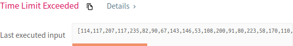
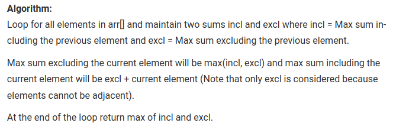

# Problema:

> *You are a professional robber planning to rob houses along a street. Each house has a certain amount of money stashed, the only constraint stopping you from robbing each of them is that adjacent houses have security system connected and __it will automatically contact the police if two adjacent houses were broken into on the same night__*.

> *Given a list of non-negative integers representing the amount of money of each house, determine the maximum amount of money you can rob tonight __without alerting the police.__*


### Exemplo 1:
__Input__: nums = [1,2,3,1]  
__Output__: 4  
__Explanation__: Rob house 1 (money = 1) and then rob house 3 (money = 3).  
Total amount you can rob = 1 + 3 = 4.


### Exemplo2:
__Input__: nums = [2,7,9,3,1]  
__Output__: 12  
__Explanation__: Rob house 1 (money = 2), rob house 3 (money = 9) and rob house 5 (money = 1).  
Total amount you can rob = 2 + 9 + 1 = 12.


## Resolução:
A primeira ideia para tentar resolver o problema foi simplificar as acções possíveis do ladrão. De um modo simples, um ladrão apenas tem duas opções quando se depara com uma casa: assaltá-la ou não assaltá-la. Se escolher assaltar uma casa, não pode assaltar a casa adjacente; caso contrário pode optar por assaltar.

A resolução deste problema consiste então no conjunto destas escolhas ao longo das diferentes casas que permitam dar ao ladrão o maior "lucro" possível.


Podemos utilizar uma abordagem iterativa para a obtenção deste "lucro" máximo. Para a primeira casa, pretendemos obter o valor máximo entre os eventos resultantes do seu assalto e os eventos resultantes do seu "não assalto" e por aí adiante:

```
lucro = max(assaltarCasa(0), naoAssaltarCasa(0))

assaltarCasa(index) {
  nums[index] +
  max(assaltarCasa(index + 2), naoAssaltarCasa(index+2))
}


naoAssaltarCasa(index) {
  max(assaltarCasa(index+1), naoAssaltarCasa(index+1))
}

return lucro
```

O código Java:

```
class Solution {
    public int rob(int[] nums) {
        return Math.max(robHouse(0, nums), notRobHouse(0,nums));         
    }


    public int robHouse(int index, int[] nums) {
        if(index > nums.length-1) return 0;

        return nums[index] + Math.max(robHouse(index+2, nums), notRobHouse(index+2, nums));
    }

    public int notRobHouse(int index, int[] nums) {
        if(index > nums.length-1) return 0;

        return Math.max(robHouse(index+1, nums), notRobHouse(index+1, nums));
    }
}
```

A primeira submissão:



Depois de muito deambular, tive de pesquisar o conceito do problema (*max sum of non adjacent elements*) e encontrei o seguinte:



O pseudo-código fica algo do género:

```
for (int i = 0; i < array.lenght; i++) {
  excl = max(incl,excl)
  incl = array[i] + excl
}
return max(incl,excl)
```

O código Java:

```
public int rob(int[] nums) {
    int excl = 0;
    int incl = 0;
    for(int i = 0; i < nums.length; i++) {
        int newExcl = Math.max(incl,excl);
        int newIncl = nums[i] + excl;
        excl = newExcl;
        incl = newIncl;
    }
    return Math.max(excl, incl);         
}
```

A submissão:


