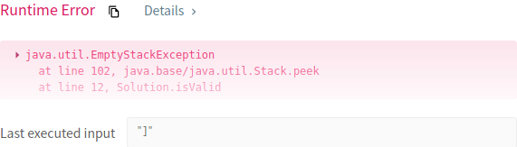
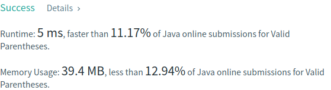
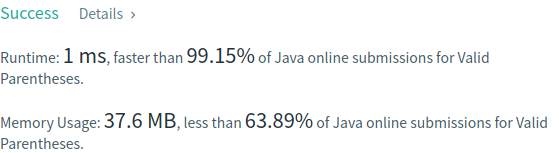

# Problema:

> *Given a string containing just the characters '(', ')', '{', '}', '[' and ']', determine if the input string is valid.*

> *An input string is valid if:*
  - *Open brackets must be closed by the same type of brackets.*
  - *Open brackets must be closed in the correct order.*  

*Note that an empty string is also considered valid.*


### Exemplo 1:
__Input__: "( )"  
__Output__: true

### Exemplo 2:
__Input__: "( )[ ]{ }"  
__Output__: true

### Exemplo 3:
__Input__: "( ]"
__Output__: false

### Exemplo 4:
__Input__: "( [ ) ]"  
__Output__: false

### Exemplo 5:
__Input__: "{ [ ] }"  
__Output__: true


## Resolução:
O primeiro instinto foi tentar satisfazer cada uma das condições que tornam uma string válida.


O primeiro ponto pode ser satisfeito se tivermos um contador para os diversos tipos de *brackets*. Se no final de percorrer a string tivermos o mesmo número de *opening* e *closing* *brackets* para cada tipo diferente de *bracket*, podemos admitir que todos os *opening brackets* são fechados pelo seu tipo correspondente.

Porém, o segundo ponto não consegue ser garantido utilizando apenas a abordagem para solucionar o primeiro ponto.

Depois de pensar um pouco decidi utilizar uma abordagem que envolve pilhas.

Os caracteres da string são percorridos à mesma, mas quando é encontrado um *opening bracket* este é colocado numa pilha. Deste modo conseguimos obter o *bracket* que foi aberto mais recentemente, pois este estará sempre no topo da pilha.

Se nos depararmos com um *closing bracket* e este não corresponder ao *opening bracket* que está no topo da pilha, isto significa que o *opening bracket* mais recente não é fechado pelo seu *bracket* inverso. Podemos logo aí terminar o programa e retornar *false*.

Se o *closing bracket* corresponder ao tipo inverso do *opening bracket* no topo da pilha, significa que o *opening bracket* será fechado correctamente. Podemos então dar *pop* deste *bracket* e continuar o processo.

Se no final da travessia pela string a pilha estiver vazia, podemos devolver o valor *true*, pois todos os *opening brackets* foram fechados correctamente e na ordem correcta.

O pseudo-código:
```
for (int i=0; i < s.length; i++) {
  char c = s.charAt(i)
  if(isOpeningBracket(c)
    stack.push(c)

  else {
    char stackTop = stack.peek()
    if(inverse(stackTop)  == c)
      stack.pop()

    else return false
  }
}
return stack.empty()
```

Para melhor ilustrar isto podemos utilizar o exemplo em que a string consiste em : "{ ( ) }"

A stack começa vazia naturalmente:

```
|      |
|      |
|      |
|______|
```

O primeiro caracter da string é um *opening bracket*. Este é inserido na pilha:

```
|       |
|       |
|_______|
|___{___|
```

O próximo elemento também é um *opening bracket*:

```
|       |
|_______|
|___(___|
|___{___|
```

O elemento seguinte é um *closing bracket*: ")". É verificado se este caracter corresponde ao inverso do que está no topo da pilha. Como tal acontece, é removido o elemento do topo da pilha:

```
|       |
|       |
|_______|
|___{___|
```

A seguir, o caracter também corresponde a um *closing bracket*. É novamente verificado se o que está no topo da pilha é o inverso deste caracter. Mais uma vez a condição verifica-se e elimina-se o elemento da pilha:

```
|      |
|      |
|      |
|______|
```

Como chegámos ao fim da string e a pilha está vazia, podemos considerar que a string é válida.


O código java:

```
public boolean isValid(String s) {      
    Stack<Character> stack = new Stack<Character>();

    for(int i = 0; i < s.length(); i++) {
        char c = s.charAt(i);
        if(isOpenBracket(c))
            stack.push(c);

        else {
            char peek = stack.peek();
            if( c == getReverse(peek))
                stack.pop();
            else return false;
        }
    }

    return stack.empty();
}
```

As funções auxiliares:

```
boolean isOpenBracket(char c) {
    return (c == '(' || c == '{' || c == '[');
}

char getReverse(char c) {
    char result = '\0';

    switch(c) {
        case '(':
            result = ')';
            break;
        case '{':
            result = '}';
            break;
        case '[':
            result = ']';
            break;
    }

    return result;
}
```
A primeira submissão:   



Faltou verificar se a stack é vazia quando é dado *peek*. Além disso, podemos logo retornar *false* caso a stack esteja vazia, pois significa que não há um *opening bracket* para o *closing bracket* violando assim a validação da string.

O código:

```
Stack<Character> stack = new Stack<Character>();

  for(int i = 0; i < s.length(); i++) {
      char c = s.charAt(i);
      if(isOpenBracket(c))
          stack.push(c);

      else {
          if(stack.empty()) return false;

          char peek = stack.peek();
          if( c == getReverse(peek))
              stack.pop();
          else return false;
      }
  }

  return stack.empty();

}
```

A submissão:



Decidi fazer algumas optimizações nas funções auxiliares: substituir o switch por um simples conjunto de if's. Além disso alterar o método para receber dois caracteres e verificar se são inversos:

```
boolean areReverse(char a, char b) {
  if(a == '(') return (b == ')');
  if(a == '{') return (b == '}');
  if(a == '[') return (b == ']');
  return false;
}
```

O código principal fica então:

```
public boolean isValid(String s) {

    Stack<Character> stack = new Stack<Character>();

    for(int i = 0; i < s.length(); i++) {
        char c = s.charAt(i);
        if(isOpenBracket(c))
            stack.push(c);

        else {
            if(stack.empty()) return false;

            char peek = stack.peek();
            if(areReverse(peek, c))
                stack.pop();
            else return false;
        }
    }

    return stack.empty();

}
```

Depois de uma nova submissão:


