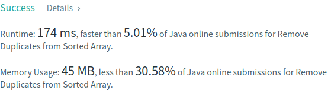

# Problema:

> *Given a sorted array nums, remove the duplicates in-place such that each element appear only once and return the new length.*

> *Do not allocate extra space for another array, you must do this by **modifying the input array** in-place with O(1) extra memory.*

### Exemplo 1:  
*Given nums = __[1,1,2]__,*  

*Your function should return length = 2, with the first two elements of nums being 1 and 2 respectively.*

*It doesn't matter what you leave beyond the returned length.*

### Exemplo 2:  
*Given nums = __[0,0,1,1,1,2,2,3,3,4]__,*  

*Your function should return length = 5, with the first five elements of nums being modified to 0, 1, 2, 3, and 4 respectively.*

*It doesn't matter what you leave beyond the returned length.*

## Clarificação:

*Confused why the returned value is an integer but your answer is an array?*

*Note that the input array is passed in by __reference__, which means modification to the input array will be known to the caller as well.*

*Internally you can think of this:*

```
// nums is passed in by reference. (i.e., without making a copy)
int len = removeDuplicates(nums);

// any modification to nums in your function would be known by the caller.
// using the length returned by your function, it prints the first len elements.
for (int i = 0; i < len; i++) {
    print(nums[i]);
}
```

## Resolução:

A primeira aordagem é algo "naive". Cada vez que se encontrar um elemento duplicado, é feito o *shift* dos elementos subsequentes para a esquerda. Á medida que vão sendo encontrados mais elementos repetidos, o alcançe deste *shift* vai diminuindo.

O código Java fica:

```
int i = 0;
int stop = nums.length;

while(i+1 < stop) {
    if(nums[i]==nums[i+1]) {
        stop--;
        for(int j = i+1; j < stop; j++)
            nums[j] = nums[j+1];
    }
    else i++;
}
return stop;
```

Podemos ver que o ciclo apenas prossegue quando se verifica que os elementos adjacentes do índice corrente que percorre o array não são duplicados. 

Depois da submissão:


