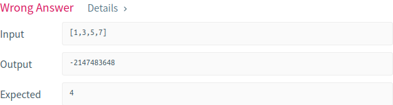
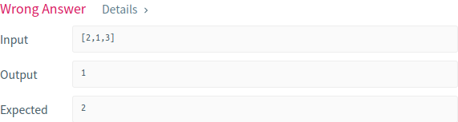
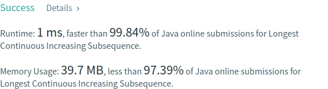

# Problema:

> *Given an unsorted array of integers, find the length of longest continuous increasing subsequence (subarray).*


### Exemplo 1:
    Input: [1,3,5,4,7]
    Output: 3
    Explanation: The longest continuous increasing subsequence is [1,3,5], its length is 3.
    Even though [1,3,5,7] is also an increasing subsequence, it's not a continuous one where 5 and 7 are separated by 4.


### Exemplo2:
    Input: [2,2,2,2,2]  
    Output: 1  
    Explanation: The longest continuous increasing subsequence is [2], its length is 1.


## Resolução:

O problema consiste em encontrar o valor máximo de qualquer coisa (neste caso o maior tamanho de uma subsequência) num array.
Podemos tirar inspiração do clássico problema que consiste em encontrar o maior elemento de um array de inteiros:

```
int maxValue = -1;

for (int i = 0; i < array.length; i++) {
    if(array[i] > maxValue)
      maxValue = array[i];
}

return maxValue;
```

Aqui é utilizada uma variável (*maxValue*) que armazena o maior valor do array encontrado até ao momento. Se por ventura for encontrado um valor que excede o *maxValue*, o mesmo é atualizado para esse valor.


A mesma técnica pode ser utilizada para a resolução deste problema: percorrer o array encontrando várias subsequências e guardar o tamanho da maior delas numa variável.

Devido ao facto de que uma subsequência ter de ser crescente e contínua, podemos utilizar um contador para calcular o tamanho desta. À medida que o array vai sendo percorrido, é testado se o elemento corrente é maior que o elemento anterior. Se tal for verdade, o contador é incrementado, significando a entrada do elemento na subsequência. Se o elemento não for maior, o contador é colocado a 0, marcando o fim da subsequência e o início de uma nova:

```
Percorrer o array:
  Se o counter for 0:
    //nova subsequência
    incrementar o contador

  Se o counter não for 0:
    O elemento anterior é menor que o elemento corrente?
      Se sim, incrementar o contador
      Se não, comparar o contador ao contadorMáximo, fazer reset ao contador

```

O código Java fica então:

```
int maxCounter = Integer.MIN_VALUE;
int currentCounter = 0;

for(int i = 0; i< nums.length; i++) {
    if(currentCounter == 0)
        currentCounter++;

    else {
        if(nums[i-1] < nums[i])
            currentCounter++;
        else {
            if(maxCounter <= currentCounter)
                maxCounter = currentCounter;
            currentCounter = 0;
        }
    }
}

return maxCounter;
```

Depois da primeira submissão, o primeiro erro:



Não foi considerado o caso em que a subsequência tem o mesmo tamanho do array de input, pelo que nunca há reset do *currentCounter* e atualização de *maxCounter*.

Novo código:

```
int maxCounter = Integer.MIN_VALUE;
int currentCounter = 0;

for(int i = 0; i< nums.length; i++) {
    if(currentCounter == 0)
        currentCounter++;

    else {
        if(nums[i-1] < nums[i])
            currentCounter++;
        else {
            if(maxCounter <= currentCounter)
                maxCounter = currentCounter;
            currentCounter = 0;
        }
    }
}
if(maxCounter <= currentCounter)
    maxCounter = currentCounter;

return maxCounter;
```

Novo código e novo erro:



O que não foi tido em conta desta vez foi o facto de que quando o *currentCounter* sofre *reset*, o valor inicial que este tem de tomar deve ser 1 e não 0.

Isto pode ser explicado pelo caso de teste onde ocorreu o erro. Quando o ciclo for chega ao elemento 1, é verificado que 1 é menor que 2, violando assim os requisitos de uma subsequência. Está na altura de criar uma subsequência nova. Para tal, o valor de *currentCounter* é colocado a 0. Porém, este 0 indica que a nova subsequência está vazia, o que não é verdade, pois esta já começa agora pelo elemento 1.

O código fica então:

```
int maxCounter = Integer.MIN_VALUE;
int currentCounter = 0;

for(int i = 0; i< nums.length; i++) {
    if(currentCounter == 0)
        currentCounter++;

    else {
        if(nums[i-1] < nums[i])
            currentCounter++;
        else {
            if(maxCounter <= currentCounter)
                maxCounter = currentCounter;
            currentCounter = 1;
        }
    }
}
if(maxCounter <= currentCounter)
    maxCounter = currentCounter;

return maxCounter;
```

Depois da submissão:


