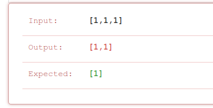
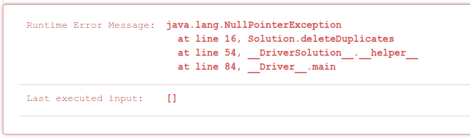
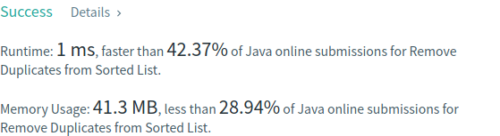

# Problema:

> *Given a sorted linked list, delete all duplicates such that each element appear only once.*


### Exemplo 1:

  Input: 1 -> 1 -> 2  
  Output: 1 -> 2

### Exemplo2:
  Input: 1 -> 1 -> 2 -> 3 -> 3  
  Output: 1 -> 2 -> 3  


## Resolução:

A classe *Solution* fornece a class *ListNode*, representando um nó da lista ligada:

```
/**
 * Definition for singly-linked list.
 * public class ListNode {
 *     int val;
 *     ListNode next;
 *     ListNode() {}
 *     ListNode(int val) { this.val = val; }
 *     ListNode(int val, ListNode next) { this.val = val; this.next = next; }
 * }
 */
```

Tratando-se de um problema de listas ligadas, pensei em começar por utilizar o clássico ciclo *while* para a travessia dos nós que compṍem a mesma:

```
while (node!= null) {
  .
  .
  .
}
```

O raciocínio foi o seguinte:  

Se o próximo nó (*head.next*) contiver um valor igual ao valor do nó corrente, esse nó é eliminado.

Para eliminar um nó, basta fazer com que o mesmo não consiga ser alcançado durante o processo de travessia da lista. Tal é feito ao modificar o apontador *next* do nó anterior ao nó a ser removido para o *next* do nó a ser removido:


```
ListNode node = head;

while(node!=null) {
    if(node.next!=null) {
        if(node.val == node.next.val)
            node.next = node.next.next;
    }

    node = node.next;
}

return head;
```
Depois da submissão, o primeiro erro:


Esta primeira abordagem falha nos casos em que existem mais do que um elemento repetido, como é possível ver. 


Para tentar explicar o motivo pelo qual o erro ocorre, pode-se usar o caso teste em que a falha foi detectada.

Quando o programa chega ao primeiro elemento com o valor de 1, é verificado que o próximo elemento contém o mesmo valor. Por isso o segundo elemento é eliminado. O que não está coberto nesta primeira abordagem é o caso em que o novo próximo elemento contém também o mesmo valor. A lista é então percorrida até ao fim sem que haja a detecção deste facto.


O ideal seria apenas prosseguir com a iteração dos elementos da lista se houver a certeza de que o próximo elemento contém um valor diferente do valor do nó corrente:


```
if(node.val == node.next.val)
    node.next = node.next.next;

else node = node.next;
```

É necessário então alterar o ciclo *while* para que estas duas condições possam ser as únicas a habitar dentro do mesmo:

```
while(node.next!=null) {
    if(node.val == node.next.val)
        node.next = node.next.next;

    else node = node.next;
}
```

Após uma nova tentativa de submissão:



Desta vez não foi coberto o caso em que a lista é vazia. Nesse caso basta retornar o valor *null*:

```
ListNode node = head;

if(node == null) return null;

while(node.next!=null) {
    if(node.val == node.next.val)
        node.next = node.next.next;

    else node = node.next;
}

return head;
```

Última submissão:


