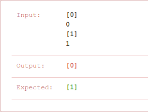
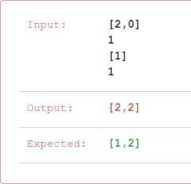

# Problema:

> *Given two sorted integer arrays nums1 and nums2, merge nums2 into nums1 as one sorted array.*

> *Note:*
  - *The number of elements initialized in nums1 and nums2 are m and n respectively.*
  - *You may assume that nums1 has enough space (size that is equal to m + n) to hold additional elements from nums2.*

### Exemplo:  
__Input__:  <br/>
  - nums1 = [1,2,3,0,0,0], m = 3  
  - nums2 = [2,5,6],       n = 3  

__Output__: [1,2,2,3,5,6]


## Resolução:

Este problema tem um ponto a ter em consideração:
  - Além de ser necessário inserir os elementos do segundo vector no primeiro, na ordem correcta, ainda é necessário deslocar os elementos já existentes no primeiro vector para acomodar os elementos a serem inseridos. Isto significa que para cada eventual inserção de um elemento, seria necessário fazer o *shift* aos elementos já existentes.

Para evitar este movimento constante de elementos, a abordagem tomada foi começar primeiro pelo preenchimento dos "lugares vazios" do primeiro vector.

Os "lugares vazios" são as posições livres do primeiro vector, criadas para que este possa acomodar os elementos do segundo vector. Estas posições tomam os índices (m, m+n).

Como o vector final tem de estar ordenado, a última posição deste deve ser tomada pelo maior elemento dos dois vectores. É então comparado o úlimo elemento dos dois vectores, e o mais elevando ocupa este último lugar. Depois deste último lugar tiver sido preenchido está na altura de preencher o ante-penúltimo. Desta vez é comparado o segundo valor mais elevado do vector cujo elemento foi escolhido na iteração anterior com o elemento mais elevado do outro vector.

Este processo repete-se até o primeiro vector estar completamento preenchido.

O código Java:

```
int lastPlace = m+n-1;
int lastIndex1 = m -1;
int lastIndex2 = n-1;


while(lastIndex1>=0 && lastIndex2>=0) {
    int number1 = nums1[lastIndex1];
    int number2 = nums2[lastIndex2];

    if(number1 > number2) {
        nums1[lastPlace] = nums1[lastIndex1];
        lastIndex1--;
    }
    else {
        nums1[lastPlace] = nums2[lastIndex2];
        lastIndex2--;
    }
    lastPlace--;
}
```

A primeira submissão:



Não foi tomado em consideração o caso em que o primeiro array é vazio. Neste caso podemos dizer que o novo array pode tomar o valor do segundo.

O código fica então:

```
if(m==0) {
    for(int i = 0; i< n; i++)
    nums1[i] = nums2[i];
}

else {
    int lastPlace = m+n-1;
    int lastIndex1 = m -1;
    int lastIndex2 = n-1;

    while(lastIndex1>=0 && lastIndex2>=0) {
        int number1 = nums1[lastIndex1];
        int number2 = nums2[lastIndex2];

        if(number1 >= number2) {
            nums1[lastPlace] = nums1[lastIndex1];
            lastIndex1--;
        }
        else {
            nums1[lastPlace] = nums2[lastIndex2];
            lastIndex2--;
        }
        lastPlace--;
    }
}   
```

Outra submissão:



Agora o erro é um pouco mais complexo:

Depois de ter sido preenchido o primeiro "lugar livre" com o maior valor dos dois elementos (o elemento 2), lastIndex1 é decrementado (toma agora o valor de -1). Este decremento termina a execução do ciclo *while*, sem haver oportunidade de preencher o primeiro indice do primeiro array. Este deveria ter sido preenchido com o elemento 1.

Para resolver este problema, o ciclo *while* foi modificado para apenas depender da finalização do processamento de todos os elementos do segundo vector (lastIndex2 >=0). Caso o lastIndex1 do primeiro vector tome valores inferiores a 0, number1 toma o menor valor que um inteiro pode tomar, Integer.MIN_VALUE. Desta forma, os elementos do segundo vector serão sempre escolhidos para preencher as posições restantes do primeiro vector.

O código Java fica então:

```
if(m==0) {
    for(int i = 0; i< n; i++)
    nums1[i] = nums2[i];
}

else {
    int lastPlace = m+n-1;
    int lastIndex1 = m -1;
    int lastIndex2 = n-1;

    while(lastIndex2>=0) {
        int number1 = (lastIndex1>=0) ? nums1[lastIndex1]: Integer.MIN_VALUE;
        int number2 = nums2[lastIndex2];
        if(number1 > number2) {
            nums1[lastPlace] = nums1[lastIndex1];
            lastIndex1--;
        }
        else {
            nums1[lastPlace] = nums2[lastIndex2];
            lastIndex2--;
        }
        lastPlace--;
    }
}   
```

Depois de mais uma submissão:


